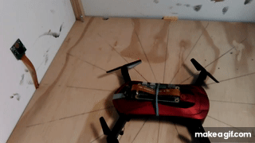
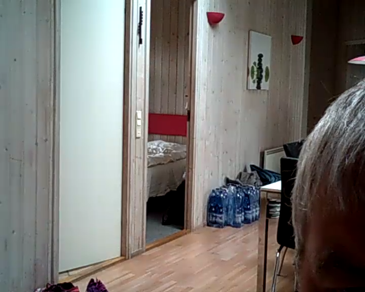
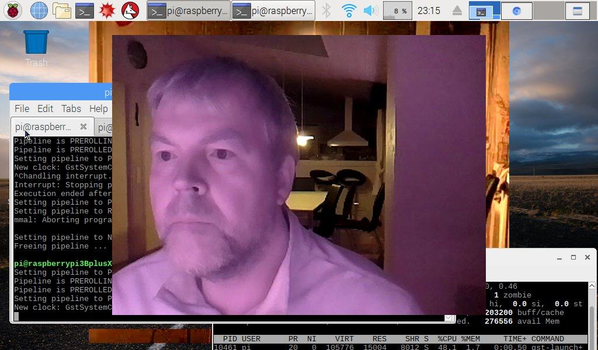
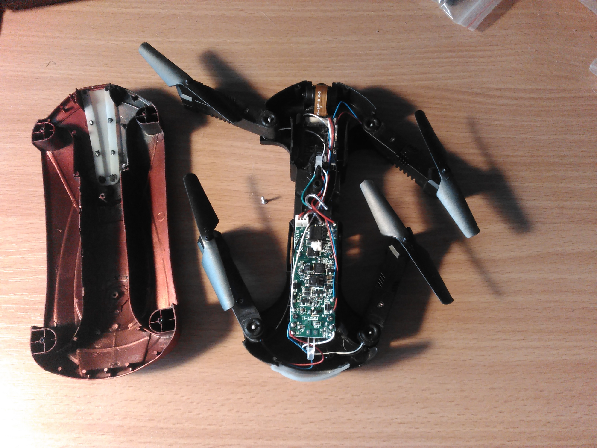
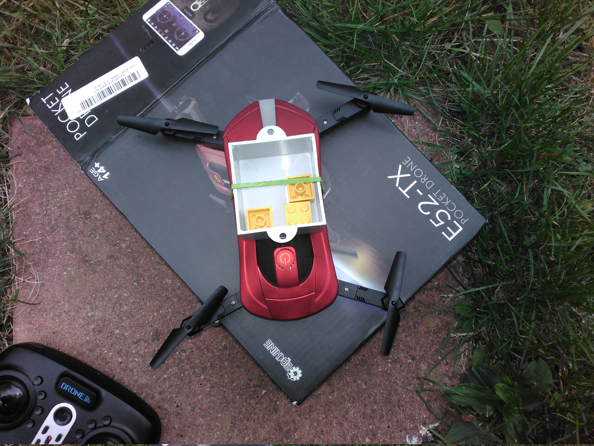

# wireless-control-Eachine-E52-drone
Wireless control Eachine E52 FPV drone (via TCP replay [attack])

Table of Contents
* [Usage](#usage)
* [Implementation details](#implementation-details)
* ~~[Status](#status)~~ see Issues
* [Video facts](#video-facts)
* [Motivation](#motivation)
* [E52 mods](#e52-mods)
* [Capturing wireless traffic between Android UFO app and E52 drone](#capturing-wireless-traffic-between-android-ufo-app-and-e52-drone)

## Usage

Just compile with gcc:

	$ gcc -Wall -pedantic pull_video.c -o pull_video
	$ ./pull_video > out.h264
	con(172.16.10.1:8888)
	con(172.16.10.1:8888)
	con(172.16.10.1:8888)
	syn(192.168.0.1:7060)
	syn(192.168.0.1:8060)
	con(172.16.10.1:8888)
	^C0(344226)     
	child processes killed
	$ du -sk out.h264
	340	out.h264
	$ 
 
172.16.10.1 is IP of drone AP, 192.168.0.1 is another drone IP. 172.16.10.2 is Raspberry Pi IP.

[E52.1st.pull.h264](res/E52.1st.pull.h264) is first successfully captured short video (inside vacation house).

This 720x576 frame from that first video is displayed scaled down by factor 3: 

For tools [video_framerate.sh](video_framerate.sh) and [watch_video.sh](watch_video.sh) see [Video facts](#video-facts).

## Implementation details

[pull_video.c](pull_video.c) does replay a TCP packet capture (captured with [Ettercap+Wireshark](#capturing-wireless-traffic-between-android-ufo-app-and-e52-drone)) against E52 drone and captures drone camera h264 video stream. It is self contained (inclusive 4508 bytes of TCP requests and responses), creates 6 TCP connections (2 against stealth ports), sends 19 packets over 3 of the TCP connections and then receives the h264 video.

Unlike [pull_video.py](https://cdn.hackaday.io/files/19680841989120/pull_video.py) from the [article](https://hackaday.io/project/19680-controlling-a-jjrc-h37-elfie-quad-from-a-pc) that motivated this project, I did write C program because of 30 years experience in C and not having worked much with Python. It is not nice code but does what it is intended to do. Assumptions get asserted, as well as comparisons of TCP responses with corresponding responses from packet capture. BLK(S,I) sends packet I of TCP stream S, receives response and compares against packet I+1 (even numbers are requests, odd numbers are responses). Opening a connection against stealth port with connect() hangs because no "SYN ACK" gets returned; ~~I use fork() to deal with that.~~ sending a single (hand crafted) SYN packet (and do not deal with a response in case there is one) allows for single threaded operation of pull_video.

I bought a second E52 drone as backup (again for <20$ in super sale) and noticed it has a different firmware. The use of the two drone IP addresses is switched, and most importantly, the drone video is delivered via UDP on newer firmware contrary via TCP as on first drone and what is implemented in pull_video.c currently.

## Video facts

Drone camera records 720x576 (h264) video at 25fps, as demonstrated by [video_framerate.sh](video_framerate.sh) script:
 
	$ time ./video_framerate.sh 
	con(172.16.10.1:8888)
	con(172.16.10.1:8888)
	con(172.16.10.1:8888)
	con(192.168.0.1:7060)
	con(192.168.0.1:8060)
	con(172.16.10.1:8888)
	Setting pipeline to PAUSED ...
	Pipeline is PREROLLING ...
	/GstPipeline:pipeline0/GstFPSDisplaySink:fpsdisplaysink0/GstFakeSink:fakesink0: sync = true
	/GstPipeline:pipeline0/GstH264Parse:h264parse0.GstPad:src: caps = video/x-h264, width=(int)720, height=(int)576, framerate=(fraction)0/1, parsed=(boolean)true, stream-format=(string)avc, alignment=(string)au, profile=(string)main, level=(string)3, codec_data=(buffer)014d001effe1000a674d001e8d8d405a093201000468ee3880
	/GstPipeline:pipeline0/avdec_h264:avdec_h264-0.GstPad:sink: caps = video/x-h264, width=(int)720, height=(int)576, framerate=(fraction)0/1, parsed=(boolean)true, stream-format=(string)avc, alignment=(string)au, profile=(string)main, level=(string)3, codec_data=(buffer)014d001effe1000a674d001e8d8d405a093201000468ee3880
	/GstPipeline:pipeline0/avdec_h264:avdec_h264-0.GstPad:src: caps = video/x-raw, format=(string)I420, width=(int)720, height=(int)576, interlace-mode=(string)progressive, pixel-aspect-ratio=(fraction)1/1, chroma-site=(string)mpeg2, colorimetry=(string)bt601, framerate=(fraction)0/1
	/GstPipeline:pipeline0/GstFPSDisplaySink:fpsdisplaysink0.GstGhostPad:sink.GstProxyPad:proxypad0: caps = video/x-raw, format=(string)I420, width=(int)720, height=(int)576, interlace-mode=(string)progressive, pixel-aspect-ratio=(fraction)1/1, chroma-site=(string)mpeg2, colorimetry=(string)bt601, framerate=(fraction)0/1
	/GstPipeline:pipeline0/GstFPSDisplaySink:fpsdisplaysink0/GstFakeSink:fakesink0.GstPad:sink: caps = video/x-raw, format=(string)I420, width=(int)720, height=(int)576, interlace-mode=(string)progressive, pixel-aspect-ratio=(fraction)1/1, chroma-site=(string)mpeg2, colorimetry=(string)bt601, framerate=(fraction)0/1
	/GstPipeline:pipeline0/GstFPSDisplaySink:fpsdisplaysink0.GstGhostPad:sink: caps = video/x-raw, format=(string)I420, width=(int)720, height=(int)576, interlace-mode=(string)progressive, pixel-aspect-ratio=(fraction)1/1, chroma-site=(string)mpeg2, colorimetry=(string)bt601, framerate=(fraction)0/1
	Pipeline is PREROLLED ...
	Setting pipeline to PLAYING ...
	New clock: GstSystemClock
	/GstPipeline:pipeline0/GstFPSDisplaySink:fpsdisplaysink0/GstFakeSink:fakesink0: sync = true
	/GstPipeline:pipeline0/GstFPSDisplaySink:fpsdisplaysink0: last-message = rendered: 14, dropped: 0, current: 27.08, average: 27.08
	/GstPipeline:pipeline0/GstFPSDisplaySink:fpsdisplaysink0: last-message = rendered: 27, dropped: 0, current: 24.99, average: 26.03
	...
	...
	/GstPipeline:pipeline0/GstFPSDisplaySink:fpsdisplaysink0: last-message = rendered: 286, dropped: 0, current: 23.81, average: 25.04
	/GstPipeline:pipeline0/GstFPSDisplaySink:fpsdisplaysink0: last-message = rendered: 300, dropped: 0, current: 26.15, average: 25.09
	0(846130)       
	child processes killed
	/GstPipeline:pipeline0/GstFPSDisplaySink:fpsdisplaysink0: last-message = rendered: 301, dropped: 0, current: 0.47, average: 21.35
	Got EOS from element "pipeline0".
	Execution ended after 0:00:14.106005211
	Setting pipeline to PAUSED ...
	Setting pipeline to READY ...
	Setting pipeline to NULL ...
	Freeing pipeline ...
	
	real	0m15.471s
	user	0m6.001s
	sys	0m0.324s
	$

The command was executed on a Raspberry Pi 3B+, and uses around 50% CPU on one of its cores, after change of avdec_h264 to hardware accelerated omxh264dec only 13% CPU.

video_framerate.sh on target platform (see Motivation), single core Pi ZeroW, shows 25 fps as well (after switch to omxh264dec), at 18% CPU. This should leave enough CPU cycles for video frame analysis and drone control. 

Just capturing drone camera video (pull_video) without gstreamer h264 parse+decode does take 2% CPU only on Pi ZeroW.

[watch_video.sh](watch_video.sh) tool displays live video. Without argument the h264 drone video stream from pull_video is used, otherwise raspivid is the h264 video source. Display performance is good because h264 decoding is fast by hardware accelerated omxh264dec, and direct output to /dev/fb0 frame buffer (works for X11 display as well). Removing comment before $gray8 definition results in 720x576 8bit gray video, instead of 12bit [i420 yuv pixel format](https://www.fourcc.org/pixel-format/yuv-i420/) video.

This 1024x600 X11 screenshot (displayed at 50%) shows 640x480 raspivid NoIR Raspberry v1 camera output on top of 720x576 E52 drone camera output directly on /dev/fb0 framebuffer: 

## Motivation

Eachine E52 drone had no problems to take 14g of additional weight and fly with Raspberry Pi ZeroW on top, see animated .gif above.

Then I read article [Controlling a JJRC H37 Elfie quad from a PC by adriajunyent-ferre](https://hackaday.io/project/19680-controlling-a-jjrc-h37-elfie-quad-from-a-pc) that showed how to control E50S drone with sending a single magic word, and started to work on this project.

The idea is to make Pi ZeroW the "riding on drone" pilot of E52 drone, connected only by rubber band and wifi, for fully autonomous drone flights (the RTC control one key "landing" function hopefully will avoid bad things to happen as last resort).

I did order 3$ VL53L0X laser ranging sensors in China. While drone has built in "altitude hold" mode, such sensor attached to Pi ZeroW will allow for "altitude above ground hold" mode. That mode will allow for fast (manual) drone flights in constant height (1m ?) above uneven terrain.

## E52 mods

Screwing off just 5 screws opens E52 drone: 
(right click images for full size view in new tab): 

#### vertical camera

Dremel away some plastic allows for vertical camera: 

E52 drone with vertical camera found lost (white) drone 10m high in group of trees: 

#### maximal backpack weight

As seen in top animated .gif and stated in Motivation section, 86.5g E52 drone easily flew with 14g of additional weight. Maximal backpack weight that works is 18.5g: 

## Capturing wireless traffic between Android UFO app and E52 drone

#### Using Android capturing apps

###### [tPacketCapture](https://play.google.com/store/apps/details?id=jp.co.taosoftware.android.packetcapture)

Installed, was not able to get it capturing, deinstalled.

###### [Packet Capture](https://play.google.com/store/apps/details?id=app.greyshirts.sslcapture)

Does not capture UDP streams. Captures each TCP stream separately. No common timebase did not allow to get insights on interactions of packets from different streams wrt time.

###### [Packet Sniffer Capture](https://play.google.com/store/apps/details?id=app.greyshirts.sslcapturess)

Does capture UDP and TCP streams, each separately. No common timebase did not allow to get insights on interactions of packets from different streams wrt time.

#### Using Raspberry tools

###### aircrack-ng

Not an option since I have no supported Wifi dongle.

###### nexmon

Cloned git repo (because it supports Raspberry Pi 3B+ wifi module) and built successfully according instructions. Unfortunately bring up new monitor device stops all networking.

###### [Ettercap](http://www.ettercap-project.org/ettercap/)

Comprehensive suite for man in the middle attacks. I followed the instructions in [Packet Sniffer](https://pentestmag.com/ettercap-tutorial-for-windows/) section and was immediately able to capture the traffic between Android and drone (via MITM ARP poisoning) with Wireshark running on Raspberry Pi. There are many TCP retransmission packets in the capture, but Android app worked fine.

This is the packet capture taken with Ettercap, which is the basis of controlling the drone:
[E52.pcapng](res/E52.pcapng)

First drone was powered. Then Android connected to drone AP. Then Wireshark packet capture got started. Next Android UFO app was started, and "Play" was pressed. After live drone camera video appeared on Android, packet capture was stopped.
